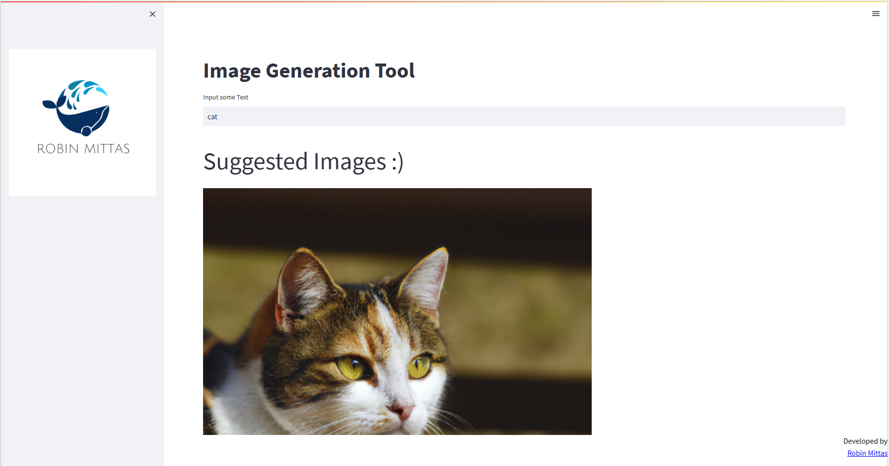

## Image Generator
This Application queries OpenAI's Image Gerneration API and you can run the minimalistic Application using following commands:

1. Create OpenAI Account (e.g. with Google Account) and create an API Key
2. Store API Key in env_vars.yaml as: "open_ai_api_key": "xxxxxx"
3. Install Requirements
4. Run following commands
```
cd streamlit-image-generation
streamlit run .\app.py
```

## Final Result




